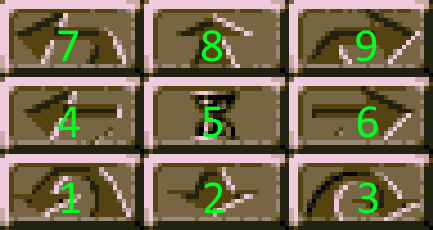
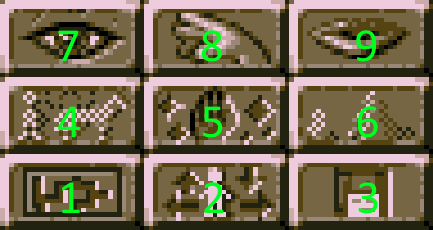
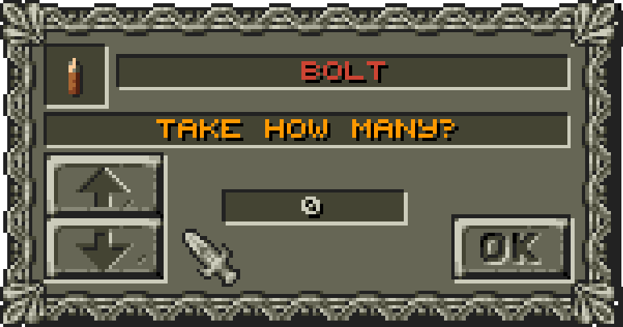

# Controls

## General

Input | Action
--- | ---
1 to 6 | Select party member 1 to 6
F1 to F6 | Open inventory of party member 1 to 6
F7 | Change battle speed (use Ctrl, Shift or Alt to change backwards)
F8 | Change graphic filter (use Ctrl, Shift or Alt to change backwards)
F9 | Change graphic overlay (use Ctrl, Shift or Alt to change backwards)
F10 | Change color effect (use Ctrl, Shift or Alt to change backwards)
PrintScreen | Take screenshot (stored in folder Screenshots)
Ctrl + P | Take screenshot (stored in folder Screenshots)
Escape | Generally aborts or closes things
Return | Generally submits or closes things
Space | Generally closes things
Ctrl + 0 to 9 | Quick save in slots 1 to 10 (0 is slot 10)
Ctrl + Shift + 0 to 9 | Quick load from slots 1 to 10 (0 is slot 10)
NumPad 1 to 9 | Action buttons in lower right corner (see below)

**Note:** Changing the battle speed is forbidden during an active battle round. This means if the battle actions are currently performed. You still can change the battle speed between rounds when you setup your actions.

**Note:** The default battle speed requires you to click after actions. All other speeds (+x%) will execute battle actions automatically at a given pace.

## Amount popups

Input | Action
--- | ---
Page Up | Max amount
Page down | Min amount (0)
Home (Pos1) | Min amount (0)
End | Max amount
Up | +1
Down | -1
Return | Confirm
Escape | Abort

Right clicking on the arrow buttons will select the minimum or maximum as well but right clicking somewhere else will close the popup and abort.

## Inventory

Input | Action
--- | ---
Ctrl + Left Click | Use item
Shift + Left Click | Equip or unequip item

Right clicking a stack of items will take all of them immediately. Left clicks would open the amount popup to select how many you want to take.

Dragging items can be aborted with right click or escape key.

*to be continued ...*
